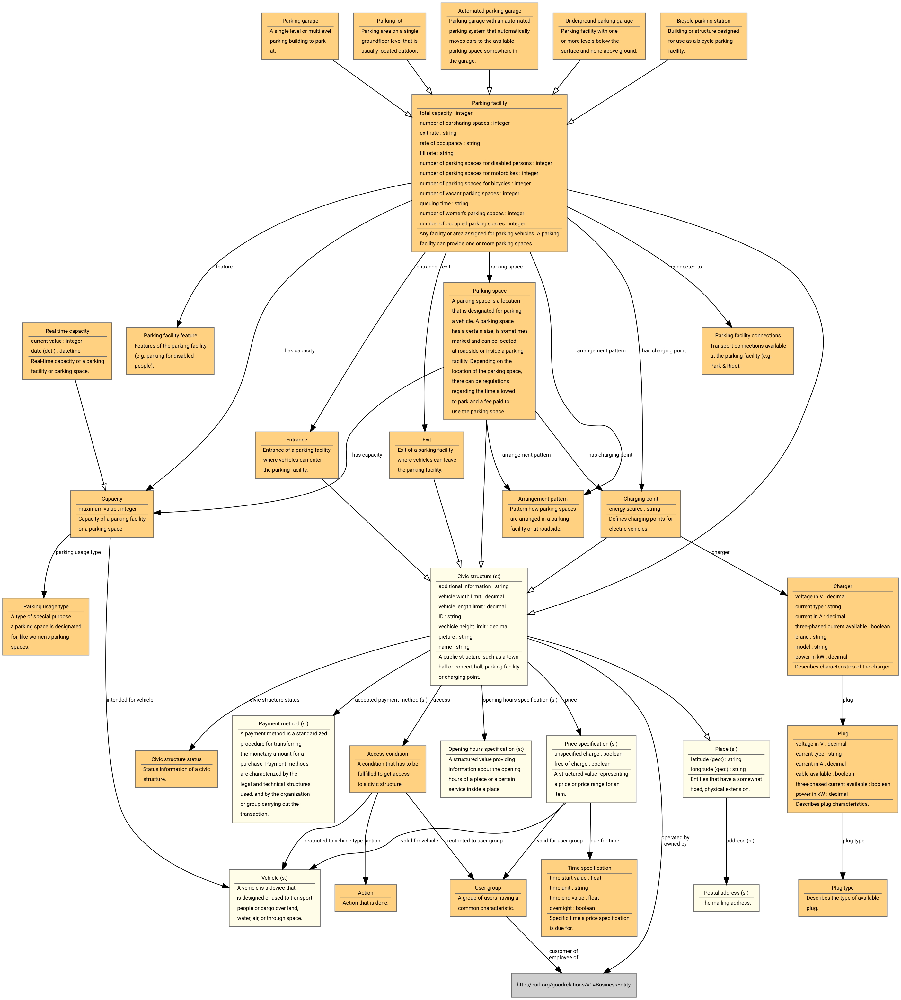

MobiVoc is an open vocabulary for future-oriented mobility solutions.

New mobility concepts and better data networking are both crucial factors for
global economic development. To invent innovative and sustainable mobility
concepts, new data-based value-added services are required.

Our goal is to significantly improve the data mobility between all stakeholders by providing a standardized vocabulary using Semantic Web technologies and ontologies. 
For the open vocabulary covering various mobility aspects we use RDF (Resource Description Framework) - a recommended specification of the World Wide Web Consortium (W3C) and the so-called lingua franca for the integration of data and web. 
We invite everyone who is interested to join our MobiVoc initiative and to participate in the development of the Open Mobility Vocabulary.

MobiVoc was extended in the following research projects: [LIMBO](https://www.limbo-project.org/), [bIoTope](https://biotope-project.eu/).

## Table of Contents

* [Latest Release](#latest-release)
* [Links](#links)
* [Class diagram](#class-diagram)
* [Example data](#example-data)
* [Repository Files](#repository-files)
  * [Schema](#schema)
  * [Examples](#examples)

## Latest Release

* [mobivoc_v1.0.0.ttl](https://github.com/vocol/mobivoc/releases/download/v1.0.0/mobivoc_v1.0.0.ttl) - Ontology (Turtle document)
* [mobivoc_v1.0.0.png](https://github.com/vocol/mobivoc/releases/download/v1.0.0/mobivoc_v1.0.0.png) - Class diagramm (PNG)
* [mobivoc_v1.0.0.svg](https://github.com/vocol/mobivoc/releases/download/v1.0.0/mobivoc_v1.0.0.svg) - Class diagramm (SVG)

## Links

* Homepage: [mobivoc.org](http://www.mobivoc.org/#)
* Schema page and namespace: [schema.mobivoc.org](http://schema.mobivoc.org/) (suggested prefix: `mv`)
* LOV entry: [@lov.okfn.org](http://lov.okfn.org/dataset/lov/vocabs/mv)
* WebVOWL Visualization: [@visualdataweb.de](http://www.visualdataweb.de/webvowl/#iri=http://schema.mobivoc.org/)
* oops Report: [@oops.linkeddata.es](http://oops.linkeddata.es/response.jsp?uri=http://schema.mobivoc.org/#) (slow)

## Class diagram

Further diagrams can be found in the [diagrams folder](diagrams).

## Example data

An example dataset on how to represent charging points is given in [openchargemap.ttl](examples/openchargemap.ttl). Data is taken from [OpenChargeMap](https://openchargemap.org/) for the cities of Brussels, Lyon and Helsinki. The dataset is licensed CC BY-SA 4.0.

The API call used to retrieve the individual datasets is:

`https://api.openchargemap.io/v2/poi/?output=json&maxresults=1000&opendata=true&latitude=50.8504500&longitude=4.3487800&distance=20&distanceunit=km`

## Repository Files

### Schema

* [schema/Metadata.ttl](schema/Metadata.ttl) - ontology metadata
* [schema/Core.ttl](schema/Core.ttl) - core classes and properties
* [schema/Parking.ttl](schema/Parking.ttl) - parking facilities and parking places
* [schema/ChargingPoints.ttl](schema/ChargingPoints.ttl) - charging stations
* [schema/Roadworks.ttl](schema/Roadworks.ttl) - highway roadworks
* [schema/Deprecated.ttl](schema/Deprecated.ttl) - deprecated resources, not included in the schema anymore (for documentation reasons only)

### Examples

* [examples/openchargemap.ttl](examples/openchargemap.ttl) - Example instances for charging stations
* [examples/fuelstation.ttl](examples/fuelstation.ttl) - Example instances for fuel stations
* [examples/parkingfacility.ttl](examples/parkingfacility.ttl) - Example instances for parking facilities
* [examples/roadworks.ttl](examples/roadworks.ttl) - Example instances for highway roadworks
